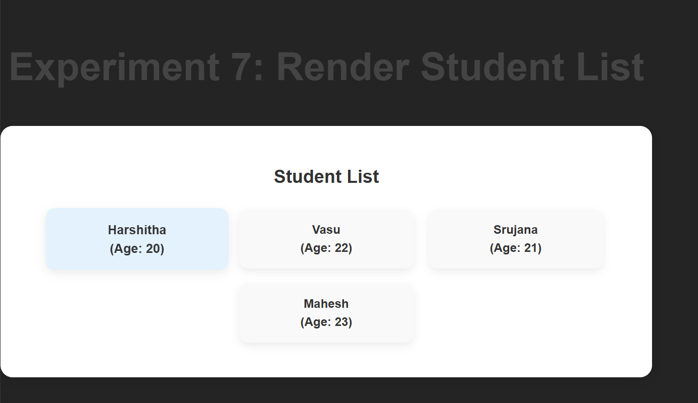

# Experiment 7: Render a List of Students using map() (CO3)

## Aim
Render a list of students dynamically in React using the `map()` function and display them with a unique `key` prop.

---
## Screenshots

Here’s a preview of the app:



## Steps to Run

### 1. Create a new component `StudentList.jsx`
File: `src/components/StudentList.jsx`
```jsx
export default function StudentList() {
  const students = [
    { id: 1, name: "Harshitha", age: 20 },
    { id: 2, name: "Ravi", age: 22 },
    { id: 3, name: "Anita", age: 21 },
    { id: 4, name: "Kiran", age: 23 },
  ];

  return (
    <div style={{ textAlign: "center", marginTop: "50px" }}>
      <h2>Student List</h2>
      <ul style={{ listStyleType: "none", padding: 0 }}>
        {students.map((student) => (
          <li
            key={student.id}
            style={{
              margin: "8px 0",
              padding: "10px 20px",
              borderRadius: "8px",
              backgroundColor: "#f0f4f8",
              display: "inline-block",
              minWidth: "200px",
            }}
          >
            {student.name} (Age: {student.age})
          </li>
        ))}
      </ul>
    </div>
  );
}
